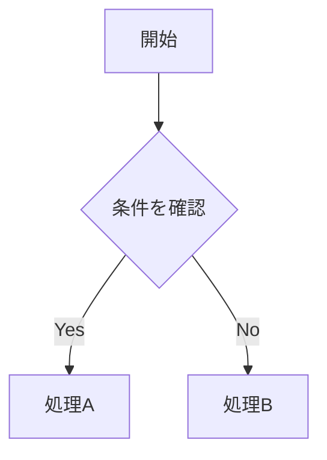
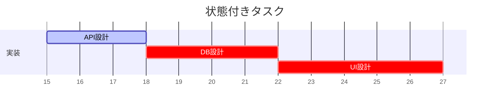

## TEST  

| 項目       | 内容         | 備考       |
|------------|--------------|------------|
| 東京       | 9,272,740  | 首都         |
| 横浜       | 3,724,844  | 港町         |
| 大阪       | 2,691,185  | 阪神タイガースの本拠地 |

 

